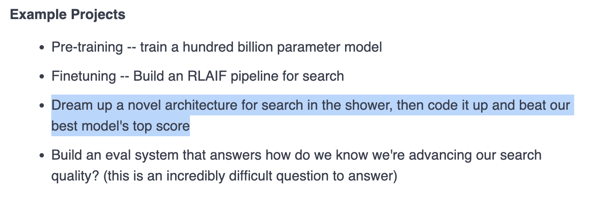

# Athena 🔍

A production-ready, free, and open-source semantic search API that delivers high-quality results using only free data sources.

## 🎯 Performance

Evaluated using the methodology described at [Exa's evaluation blog](https://exa.ai/blog/evals-at-exa):

| Benchmark | Score | Dataset Size |
|-----------|-------|--------------|
| **MS Marco** | **0.7458** | 700 queries |
| **SimpleQA** | 0.6037 | 300 queries |
| **Overall** | **0.7032** | 1000 queries (weighted) |

**Key Achievement:** Strong performance across diverse query types while using 100% free data sources!

📊 **Full benchmark results:** See [benchmark_results_v4.3.json](./benchmark_results_v4.3.json) for complete evaluation data including per-query scores and performance breakdowns.

## ✨ Features

- **100% Free** - No API keys required (except OpenAI for query expansion)
- **Semantic Search** - Uses sentence transformers for understanding
- **Multi-Source** - Combines DuckDuckGo, Wikipedia, and Wikidata
- **Ensemble Scoring** - 7 different signals for ranking
- **Query Expansion** - Automatic diversity-based reformulation
- **REST API** - Easy to integrate
- **Docker Ready** - One-command deployment
- **Scalable** - Async processing with rate limiting

## 🚀 Quick Start

### Prerequisites

- Python 3.8+
- pip
- 2GB RAM minimum
- OpenAI API key (for query expansion only)

### Installation

```bash
# Clone the repository
git clone https://github.com/yourusername/adaptive-search-api.git
cd adaptive-search-api

# Install dependencies
pip install -r requirements.txt

# Set environment variables
export OPENAI_API_KEY="your-key-here"

# Run the API
python api.py
```

The API will start on `http://localhost:8000`

### Docker Deployment

```bash
docker build -t adaptive-search-api .
docker run -p 8000:8000 -e OPENAI_API_KEY="your-key" adaptive-search-api
```

## 📖 API Documentation

### Search Endpoint

**POST** `/search`

```bash
curl -X POST http://localhost:8000/search \
  -H "Content-Type: application/json" \
  -d '{
    "query": "What is the capital of France?",
    "top_k": 5
  }'
```

**Response:**

```json
{
  "query": "What is the capital of France?",
  "results": [
    {
      "title": "Paris - Capital of France",
      "url": "https://en.wikipedia.org/wiki/Paris",
      "snippet": "Paris is the capital and most populous city of France...",
      "score": 0.95,
      "source": "wikipedia",
      "rank": 1
    }
  ],
  "metadata": {
    "query_type": "specific_factual",
    "answer_type": "location",
    "total_results": 5,
    "search_time_ms": 1234
  }
}
```

### Health Check

**GET** `/health`

```bash
curl http://localhost:8000/health
```

## 🏗️ Architecture

```
┌─────────────────────────────────────────┐
│           User Query                     │
└──────────────┬──────────────────────────┘
               │
               ▼
┌─────────────────────────────────────────┐
│      Query Analysis & Expansion          │
│    (GPT-4o-mini for diversity)           │
└──────────────┬──────────────────────────┘
               │
               ▼
┌─────────────────────────────────────────┐
│         Multi-Source Search              │
│  ┌──────────┐ ┌────────┐ ┌──────────┐  │
│  │ DuckDuckGo│ │Wikipedia│ │ Wikidata │  │
│  └──────────┘ └────────┘ └──────────┘  │
└──────────────┬──────────────────────────┘
               │
               ▼
┌─────────────────────────────────────────┐
│      Ensemble Scoring (7 Signals)        │
│  • Semantic  • BM25  • Answer Type       │
│  • Quality   • Intent • Entity           │
│  • Diversity                             │
└──────────────┬──────────────────────────┘
               │
               ▼
┌─────────────────────────────────────────┐
│      Result Clustering & Ranking         │
└──────────────┬──────────────────────────┘
               │
               ▼
┌─────────────────────────────────────────┐
│           Top-K Results                  │
└─────────────────────────────────────────┘
```

## 🔧 Configuration

Create a `.env` file:

```env
# Required
OPENAI_API_KEY=sk-...

# Optional
API_HOST=0.0.0.0
API_PORT=8000
LOG_LEVEL=INFO
MAX_WORKERS=4
CACHE_SIZE=1000
RATE_LIMIT_PER_MINUTE=60
```

## 📊 Benchmarking

Want to run evaluations yourself? Use our Colab-ready evaluation script:

```bash
# Edit the configuration at the top of the file:
# - Set your OpenAI API key
# - Set MS_MARCO_SAMPLES (max 700)
# - Set SIMPLEQA_SAMPLES (max 300)

python colab_evaluation.py
```

The script will:
1. Run searches on your selected sample size
2. Evaluate results using GPT-4o (same methodology as our benchmarks)
3. Generate a detailed results file with scores

Perfect for testing on Google Colab or your local machine!

## 🤝 Contributing

Contributions are welcome! Please see [CONTRIBUTING.md](CONTRIBUTING.md)

## 📄 License

MIT License - see [LICENSE](LICENSE)

## 🙏 Acknowledgments

- Built on top of free data sources: DuckDuckGo, Wikipedia, Wikidata
- Uses sentence-transformers for semantic understanding
- Inspired by research on multi-source search and ensemble ranking

## 🎨 Inspiration

This project was inspired by the need for accessible, high-quality search that doesn't require expensive API subscriptions.


